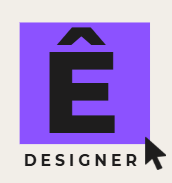

# Portfólio Êmylle | Designer



## 📋 Sobre o Projeto

Este é meu portfólio profissional como designer, desenvolvido com HTML e CSS. O site apresenta meus trabalhos, habilidades e experiência na área de design, com foco em UI/UX, branding e social media.

## 🎨 Features

- Design responsivo
- Navegação suave
- Seções bem definidas:
  - Início (Hero)
  - Sobre
  - Habilidades
  - Projetos
  - Contato
- Animações sutis
- Gradientes modernos
- Cards interativos

## 🛠️ Tecnologias Utilizadas

- HTML5
- CSS3
- Google Fonts (Poppins)
- Feather Icons

## 📂 Estrutura do Projeto

```
├── index.html
├── components/
│   └── images/
│       ├── dentist.png
│       ├── favicon.ico
│       ├── fotoporti.jpg
│       ├── instrumento.png
│       └── ...
├── styles/
│   ├── media.css
│   └── styles.css
└── fonts/
```

## 🎯 Principais Características

- **Design Moderno**: Interface limpa e profissional com gradientes e sombras sutis
- **Paleta de Cores**: Tons de roxo e azul (#8c52ff, #4e74e5) com fundo suave
- **Tipografia**: Família Poppins para legibilidade e elegância
- **Componentes Reutilizáveis**: Cards, botões e seções bem estruturadas
- **Performance**: Otimização de imagens e código CSS organizado

## 🚀 Como Usar

1. Clone este repositório
2. Abra o arquivo `index.html` em seu navegador
3. Para desenvolvimento:
   - Modifique o HTML conforme necessário
   - Ajuste os estilos em `styles.css`
   - Personalize as media queries em `media.css`

## 📱 Responsividade

O site é totalmente responsivo, adaptando-se a diferentes tamanhos de tela:
- Desktop (1200px+)
- Tablet (768px - 1199px)
- Mobile (até 767px)

## 🔗 Links Importantes

- [LinkedIn](https://www.linkedin.com/in/emyllebsousa)
- [Instagram](https://www.instagram.com/beatriz_devv)
- [WhatsApp](https://wa.link/4ldy2z)

## 📄 Licença

Todos os direitos reservados - Êmylle © 2025

---

⌨️ Desenvolvido com ❤️ por Êmylle
